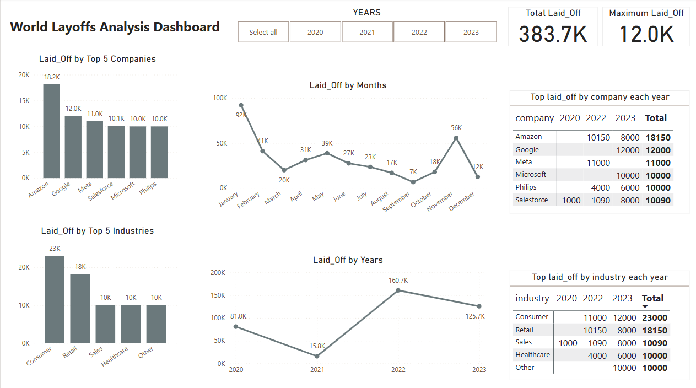

# SQL - Power BI Dashboard

Welcome to the **SQL - Power BI Dashboard** project. This repository contains a comprehensive Power BI solution that integrates SQL queries and data analysis for visualizing global layoffs.

## Table of Contents
- [Overview](#overview)
- [Repository Structure](#repository-structure)
- [Dashboard File](#dashboard-file)
- [Data](#data)
- [SQL Queries](#sql-queries)
- [Installation and Setup](#installation-and-setup)
- [Usage](#usage)
- [Requirements](#requirements)
- [Contributing](#contributing)
- [License](#license)
- [Acknowledgements](#acknowledgements)

## Overview
This project leverages SQL and Power BI to provide insights into global layoffs. It is composed of the following components:

- **Power BI Dashboard:** The main dashboard file (`SQL-PowerBI-Dashboard.pbix`) provides interactive visualizations.
- **SQL Scripts:** A set of SQL queries to analyze layoffs by country, industry, and company.
- **Dataset:** A CSV file (`layoffs.csv`) that contains the raw data used for analysis.

## Repository Structure
SQL-PowerBI-Dashboard/ ├── data/ │ └── layoffs.csv # CSV file containing layoffs data ├── dashboard/ │ └── SQL-PowerBI-Dashboard.pbix # Main Power BI dashboard file ├── sql/ │ ├── world_layoffs_analysis.sql # SQL for global layoffs analysis │ ├── top_industries_lay_offs.sql # SQL for top industries layoffs │ └── top_company_lay_offs.sql # SQL for top company layoffs ├── images/ │ └── banner.png # Banner image to display on GitHub main page ├── README.md # This file ├── .gitignore # Files and folders to ignore ├── LICENSE # License file (MIT License) └── requirements.txt # (Optional) Python dependencies for extra analysis

## Dashboard File
- **SQL-PowerBI-Dashboard.pbix:**  
  This file is located in the `dashboard/` folder. Open it in [Power BI Desktop](https://powerbi.microsoft.com/en-us/desktop/) to explore the interactive dashboard and modify visualizations as needed.

## Data
- **layoffs.csv:**  
  Located in the `data/` folder, this file contains the raw layoffs data that is used in the dashboard and SQL queries.

## SQL Queries
All SQL scripts are in the `sql/` folder:
- **world_layoffs_analysis.sql:** Contains queries that provide a global overview of layoffs.
- **top_industries_lay_offs.sql:** Contains queries to identify which industries are most affected.
- **top_company_lay_offs.sql:** Contains queries to show which companies have experienced the highest layoffs.

## Installation and Setup
1. **Clone the Repository:**
   bash
   git clone https://github.com/venky1408/SQL-PowerBI-Dashboard.git
   cd SQL-PowerBI-Dashboard

Data:
Ensure the layoffs.csv file is located in the data/ folder. If you wish to update or replace the data, put your CSV file in this folder.

Optional: Python Environment Setup:
If you plan to perform additional data analysis with Python, create a virtual environment and install dependencies:

    bash
    python -m venv venv
    source venv/bin/activate    # On Windows: venv\Scripts\activate

    pip install -r requirements.txt

Usage
Open the Dashboard:
Launch Power BI Desktop and open dashboard/SQL-PowerBI-Dashboard.pbix.

Run SQL Queries:
Use your preferred SQL client to run the scripts in the sql/ folder against your database (after importing layoffs.csv).

Customize:
Modify the dashboard or SQL queries to fit your analysis needs.

Requirements
If you plan to use Python for further analysis, you may need these packages:
    pandas>=1.2.0
    numpy>=1.19.0
    SQLAlchemy>=1.3.0
    Install them via:

    bash
    pip install -r requirements.txt

Contributing
Contributions are welcome! To contribute:

Fork the repository.
    Create a feature branch.
    Make your changes and open a pull request with a detailed explanation.

License
This project is licensed under the MIT License – see the LICENSE file for details.

Acknowledgements
Thanks to the Power BI community for their excellent tools and documentation.Appreciation for the data providers and analysts whose work has inspired this project.

This project was only possible because of a Github friend. Thank you so much for the contribution. Happy to be a part of Gitub famil.....
